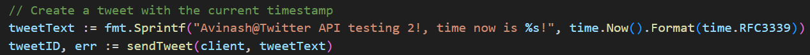
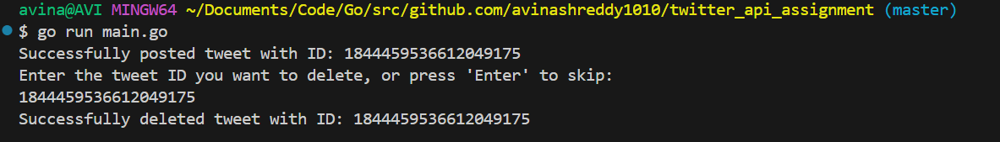

# Twitter API Interaction with Go

## Introduction

This project demonstrates how to interact with the Twitter API using the Go programming language. It focuses on creating and deleting tweets while handling OAuth 1.0a authentication. Below are done in this assignment. 

- Set up and use the Twitter API.
- Authenticate using OAuth 1.0a in a Go program.
- Post a tweet programmatically.
- Delete a tweet using its unique ID.
- Handle errors such as invalid credentials or invalid tweet IDs.

---

## Setup Instructions

### Set Up a Twitter Developer Account

1. Go to the https://developer.x.com/en and log in with your twitter account. 
2. Apply for a developer account. 
3. Create a project and an app in the developer account. 

### Generate API Keys

Once App is created, we have to generate the Keys and Tokens. 

1. Copy Consumer Key and Consumer Secret in **API Key and Secret**
2. Copy Access Token and Access Token Secret in **Access Token and Secret**
3. Generate and Copy the **Bearer Token**
4. The tokens and secrets are defined in the .env file in our code. 

## Program Details

Our code lets us create a new tweet by sending a POST request, When executed a tweet with the current timestamp is sent. Please find below screenshot. 

We can delete the tweet by providing tweetID. Upon successful deletion, a confirmation message is displayed.

We need to execute _go run main.go_ if we want to run the application. Our tweet will be posted once we run main.go
If we want to delete the tweet, we need to provide TweetID which we want to delete. 

